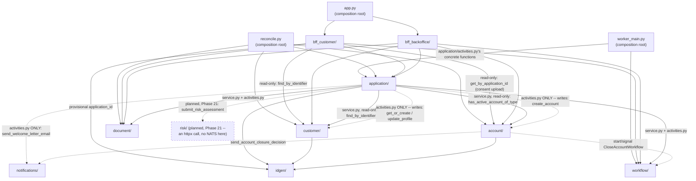

# Application modules diagram — Python package dependency graph

Source of truth: `CLAUDE.md`'s "Module dependency graph" (the ASCII
version, with the exact per-module rules). This is the same graph,
rendered — useful to check "is this import allowed?" at a glance
without parsing the ASCII art. **Read direction: `A --> B` means "A
imports B."** A dashed arrow marks either a narrow, deliberate
exception to the otherwise-strict layering, or an edge that only
exists once Phase 21 (planned, not yet built — dotted node border)
ships.

## Reading this diagram

- **`document/`, `workflow/`, `idgen/`, `notifications/` have no
  outgoing arrows** — they're leaves. `idgen/` is the plainest of all
  (one pure function, zero I/O, zero state); `document/` and
  `workflow/` are leaves with one external dependency each (Mayan,
  Temporal respectively) but no internal one; `notifications/` (Phase
  18, P18-2) is the same "zero dependency on anything else in this
  codebase" shape as `idgen/`, promoted out of `bff_customer/` so a
  Temporal *activity* (not just a BFF route handler) can send an email.
- **`risk/` (planned, Phase 21, dotted border) is a leaf, but not a NATS
  client** — no outgoing arrows, and (revised after a follow-up design
  decision) no NATS dependency either: `service.submit_risk_assessment`
  is a plain `httpx` call to a new, separately-deployed NATS Adapter
  service (`risk-adapter` — not part of this diagram, since it's
  outside the `loan_onboarding` package entirely, same treatment
  `mock_risk_engine/` already gets). Not built yet; included here so the
  target shape is visible alongside what's actually running today.
- **`customer/` and `account/` both have an edge to `idgen/`, for
  primary-key generation — but `account/` is no longer a pure leaf**
  (built, Phase 18 P18-4): it also has dashed edges to `workflow/` (to
  start/signal `CloseAccountWorkflow`) and `notifications/` (the
  closure-decision email), both from `account/service.py`/
  `account/activities.py`. `customer/` is unaffected — it still has
  exactly the one edge, to `idgen/`, and nothing else.
- **The dashed arrows are the whole point of this diagram** — narrow,
  deliberate exceptions to the otherwise-strict layering, not sloppy
  edges. Three shapes of dashed edge appear:
  1. **File-level, not module-level**: `application/` has *both* a
     solid and a dashed edge into `customer/`/`account/` — the solid
     edge is `application/service.py`'s **read-only** calls
     (`find_by_identifier`, `has_active_account_of_type`); the dashed
     edge is `application/activities.py`'s **write** calls
     (`get_or_create`/`update_profile`, `create_account`), for
     approval-time provisioning (`CLAUDE.md`'s "Applying without being
     a customer yet"). Which *file* inside `application/` matters here,
     not just which module — an import-linter contract has to encode
     this file-level distinction.
  2. **`activities.py`-only exceptions to reach a leaf a module's
     `service.py` has no other reason to import**: `application/` →
     `notifications/` (built, Phase 19 — only for the Welcome Letter
     email) and `account/` → `notifications/` (built, Phase 18). Same
     shape, same reasoning, two separate call sites.
  3. **Planned, not yet built (Phase 21)**: `application/` → `risk/`
     (`submit_risk_assessment`). Renders dashed purely because it
     doesn't exist in the codebase yet, not because it's a narrow
     exception the way (1) and (2) are.
- **`bff_customer/` and `bff_backoffice/` never import each other** —
  no arrow between them, and neither is a source for the other. Both
  feed into `app.py` (the web process's composition root), not into
  one another.
- **`reconcile.py` (Phase 15) is a third composition root**, alongside
  `app.py`/`worker_main.py` — the only files allowed to import from
  every domain module, since drift detection is a cross-cutting
  concern no single module's own leaf-purity should absorb
  (`CLAUDE.md`'s "Document/database reconciliation"). Not a running
  process like the other two — an on-demand script.
- **No fourth composition root planned for Phase 21** — an earlier
  design pass had a `risk_listener_main.py` process here, subscribing
  to NATS and signaling the workflow. Once NATS connectivity moved
  entirely to the standalone `risk-adapter` service (outside this
  package, so not drawn on this diagram at all — see
  `docs/diagrams/system-architecture.md`), there was no in-package NATS
  subscription left for a fourth composition root to own.
- **`app.py`, `worker_main.py`, and `reconcile.py` are the only nodes
  with no incoming arrows** — nothing imports a composition root;
  they're where the DAG terminates, "the one file allowed to know about
  everything" (`CLAUDE.md`).
- **No cycle anywhere** — this is what "Breaking the application ↔
  workflow cycle" (`CLAUDE.md`) was solving for: `application/` needs
  to *start* a workflow and `workflow/`'s activities need to *write*
  application data, but the diagram shows only `application/ -->
  workflow/`, never the reverse — `workflow/workflows.py` calls
  activities by string name instead of importing
  `application/activities.py` directly. The same discipline holds for
  `account/ --> workflow/`: `CloseAccountWorkflow`'s activities live in
  `account/activities.py`, called by string name, not imported back.
