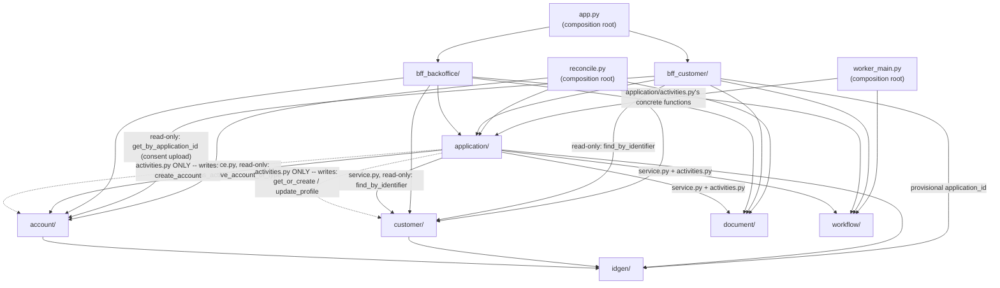

# Application modules diagram — Python package dependency graph

Source of truth: `CLAUDE.md`'s "Module dependency graph" (the ASCII
version, with the exact per-module rules). This is the same graph,
rendered — useful to check "is this import allowed?" at a glance
without parsing the ASCII art. **Read direction: `A --> B` means "A
imports B."** A dashed arrow marks the one narrow, deliberate exception
to the otherwise-strict layering.

## Reading this diagram

- **`document/`, `workflow/`, `idgen/` have no outgoing arrows** —
  they're leaves. `idgen/` is the plainest of all (one pure function,
  zero I/O, zero state); `document/` and `workflow/` are leaves with
  one external dependency each (Mayan, Temporal respectively) but no
  internal one.
- **`customer/` and `account/` have exactly one outgoing arrow each —
  to `idgen/`, for primary-key generation — and nothing else.** That's
  the one exception to "leaves import nothing" these two modules get:
  `idgen/` is deliberately so minimal (no I/O, no other module's types)
  that depending on it doesn't compromise the "pure data module" claim
  `CLAUDE.md` makes about `customer/`/`account/` elsewhere.
- **The dashed arrows are the whole point of this diagram — but note
  `application/` now has *both* a solid and a dashed edge into
  `customer/`/`account/`, not just a dashed one.** Corrected here to
  match `CLAUDE.md`'s own correction: `application/service.py` *does*
  import `customer/`/`account/` — but only their **read-only**
  functions (`find_by_identifier`, `has_active_account_of_type`). Only
  `application/activities.py` (the dashed edges) calls their **write**
  functions (`get_or_create`/`update_profile`, `create_account`), for
  approval-time provisioning (`CLAUDE.md`'s "Applying without being a
  customer yet"). This pair is the one place in the whole codebase
  where *which file inside a module* matters for whether an import is
  allowed, not just *which module* — an import-linter contract
  (`CLAUDE.md`'s "Enforcing the boundaries", `IMPLEMENTATION_PLAN.md`
  Phase 8) has to encode this file-level distinction, not just a
  module-level one.
- **`bff_customer/` and `bff_backoffice/` never import each other** —
  no arrow between them, and neither is a source for the other. Both
  feed into `app.py` (the web process's composition root), not into
  one another.
- **`reconcile.py` (Phase 15) is a third composition root**, alongside
  `app.py`/`worker_main.py` — the only files allowed to import from
  every domain module, since drift detection is a cross-cutting
  concern no single module's own leaf-purity should absorb
  (`CLAUDE.md`'s "Document/database reconciliation"). Not a running
  process like the other two — an on-demand script.
- **`app.py`, `worker_main.py`, and `reconcile.py` are the only nodes
  with no incoming arrows** — nothing imports a composition root;
  they're where the DAG terminates, "the one file allowed to know
  about everything" (`CLAUDE.md`).
- **No cycle anywhere** — this is what "Breaking the application ↔
  workflow cycle" (`CLAUDE.md`) was solving for: `application/` needs
  to *start* a workflow and `workflow/`'s activities need to *write*
  application data, but the diagram shows only `application/ -->
  workflow/`, never the reverse — `workflow/workflows.py` calls
  activities by string name instead of importing
  `application/activities.py` directly.
