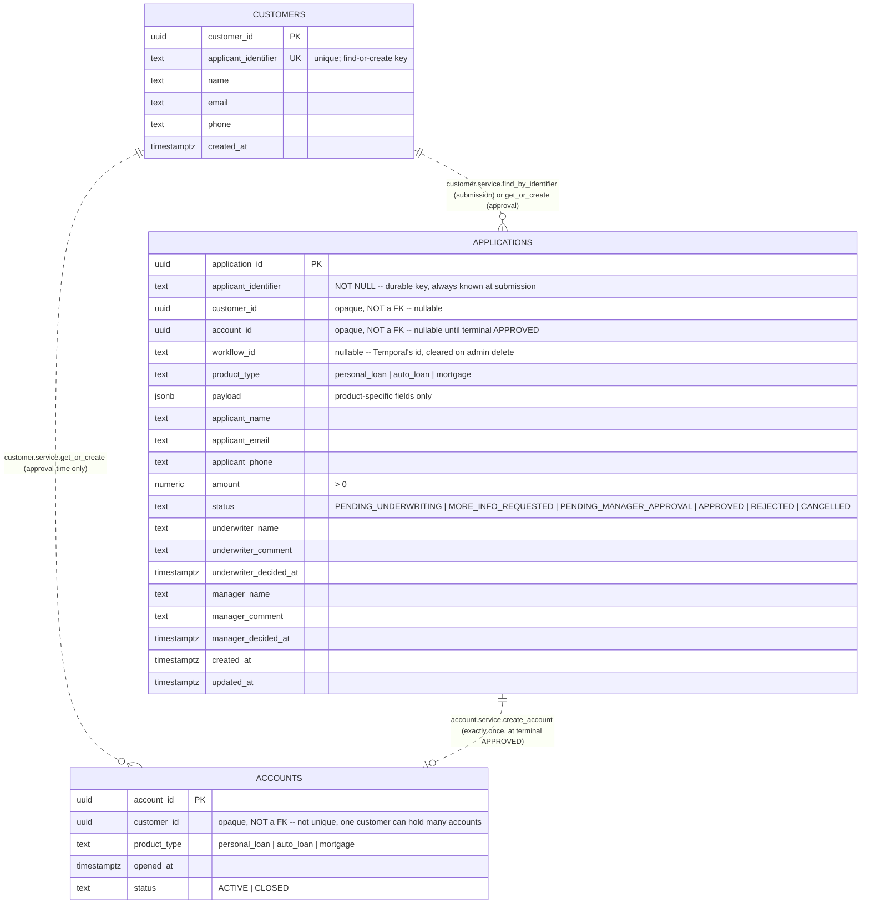

# ER diagram — `loan_onboarding` database

Source of truth: [`db/schema.sql`](../../db/schema.sql). This covers
the three Postgres tables only — Mayan's own documents live in a
completely separate database (`mayan-db`, not `loan_onboarding`; see
`CLAUDE.md`'s "Data storage") and aren't part of this diagram. For how
documents associate to these entities, see `CLAUDE.md`'s "Document
hierarchy" section.

**All three relationships below are dashed deliberately** — none of
them are real foreign keys. `CLAUDE.md`'s "Data storage" explains why:
a same-database FK would make it trivially easy to write a query that
joins across module boundaries directly, which is exactly the coupling
the module split (`customer/`, `account/`, `application/` each owning
one table) exists to prevent. Every one of these ids is resolved only
through the owning module's `service.py` — never a SQL join.

## Reading this diagram

- **`CUSTOMERS ||..o{ ACCOUNTS`** — one customer, zero or many
  accounts. Not one account *per* customer: an account is created
  exactly once per approved application, so a customer who's had three
  loans approved over time holds three accounts (`CLAUDE.md`'s
  "Applying without being a customer yet").
- **`CUSTOMERS ||..o{ APPLICATIONS`** — one customer, zero or many
  applications, but the link isn't always present: `customer_id` on an
  `APPLICATIONS` row is `NULL` for any applicant who isn't a recognized
  customer yet. `applicant_identifier` (not `customer_id`) is the
  column every customer-facing query actually filters on, precisely
  because it's never `NULL`.
- **`APPLICATIONS ||..o| ACCOUNTS`** — one application, zero or one
  account. Zero for every application that hasn't reached terminal
  `APPROVED` yet (the overwhelming majority at any given time); exactly
  one once it has. The database enforces the "exactly one once
  approved" half directly — see `applications`' `chk_approved_has_account`
  `CHECK` constraint in `db/schema.sql`.
- **No relationship line for Mayan documents** — `id_photo` (customer),
  `Welcome Letter`/`Consent` (account), and the submission-gate
  categories (application) all live in Mayan, associated by metadata
  tags, not by anything a Postgres FK or this ER diagram could express.
- **`ACCOUNTS.product_type` isn't just descriptive — it's constrained.**
  A customer's `ACTIVE` accounts may never repeat a `product_type` (a
  `CLOSED` and a new `ACTIVE` `personal_loan` account can coexist, two
  simultaneously `ACTIVE` ones can't). Enforced by a partial unique
  index — `ux_accounts_customer_active_product_type` on `(customer_id,
  product_type) WHERE status = 'ACTIVE'` — not visible as a line on
  this diagram (it constrains rows within one table, not a relationship
  between two), but load-bearing: it's the actual backstop behind
  `application.service.check_decision_allowed`'s pre-approval gate (PRD
  §9.2, `CLAUDE.md`'s "Applying without being a customer yet").
