# ER diagram — `loan_onboarding` database

Source of truth: [`db/schema.sql`](../../db/schema.sql). This covers
the eight Postgres tables only — Mayan's own *file content* still lives
in a completely separate database (`mayan-db`, not `loan_onboarding`;
see `CLAUDE.md`'s "Data storage"), never part of this diagram. **What
changed in Phase 24**: the three `*_DOCUMENT` tables below are `document/`'s
own real Postgres persistence — the primary source of truth for "what
documents exist," not just Mayan metadata anymore (see `CLAUDE.md`'s
`document/` module section) — so document *existence and ownership* now
genuinely is expressible here, even though the actual file bytes still
aren't. For the parts of the document lifecycle that remain
Mayan-only (the visual Index Template tree, file content itself), see
`CLAUDE.md`'s "Document hierarchy" section.

**Every relationship below is dashed deliberately** — none of them are
real foreign keys. `CLAUDE.md`'s "Data storage" explains why: a
same-database FK would make it trivially easy to write a query that
joins across module boundaries directly, which is exactly the coupling
the module split (`customer/`, `account/`, `application/`, `document/`
each owning their own tables) exists to prevent — including the two
same-module splits (`ACCOUNTS`/`ACCOUNT_CLOSURE_REQUESTS`,
`APPLICATIONS`/`LOAN_APPLY_REQUESTS`) and the three `document/`-owned
tables (Phase 24), which follow the same "no FKs, anywhere" rule
uniformly even though a cross-module coupling concern doesn't strictly
apply to the two same-module splits. Every one of these ids is resolved
only through the owning module's `service.py` — never a SQL join,
except `application/db.py`'s and `account/db.py`'s own internal `LEFT
JOIN`s between their respective table pairs, which stay inside those
modules.

```mermaid
erDiagram
    CUSTOMERS ||..o{ ACCOUNTS : "customer.service.get_or_create (approval-time only)"
    CUSTOMERS ||..o{ APPLICATIONS : "customer.service.find_by_identifier (submission) or get_or_create (approval)"
    APPLICATIONS ||..o| ACCOUNTS : "ACCOUNTS.application_id (account.service.create_account, exactly once, at terminal APPROVED)"
    ACCOUNTS ||..o{ ACCOUNT_CLOSURE_REQUESTS : "one row per closure request against this account (Phase 22, 1:M)"
    APPLICATIONS ||..o| LOAN_APPLY_REQUESTS : "onboarding-workflow tracking, joined in via LEFT JOIN (Phase 23, 1:1)"
    APPLICATIONS ||..o{ APPLICATION_DOCUMENT : "document.service.upload -- unlimited per category (Phase 24, 1:M)"
    ACCOUNTS ||..o{ ACCOUNT_DOCUMENT : "generate_welcome_letter / upload_consent -- at most one per category (Phase 24, 1:M)"
    CUSTOMERS ||..o{ CUSTOMER_DOCUMENT : "promote_government_id_to_customer_photo -- at most one per category (Phase 24, 1:M)"

    CUSTOMERS {
        string customer_id PK "CUS- + random 9-digit number, app-assigned via idgen"
        text applicant_identifier UK "unique; find-or-create key"
        text name
        text email
        text phone
        timestamptz created_at
    }

    ACCOUNTS {
        string account_id PK "ACC- + random 9-digit number, app-assigned via idgen"
        string customer_id "opaque, NOT a FK -- not unique, one customer can hold many accounts"
        string application_id UK "opaque, NOT a FK -- NOT NULL, unique; points at the owning application"
        text product_type "personal_loan | auto_loan | mortgage"
        timestamptz opened_at
        text status "ACTIVE | CLOSURE_REQUESTED | CLOSED -- current-state only since Phase 22, see ACCOUNT_CLOSURE_REQUESTS"
    }

    ACCOUNT_CLOSURE_REQUESTS {
        string closure_request_id PK "ACR- + random 9-digit number, app-assigned via idgen"
        string account_id "opaque, NOT a FK -- many rows per account over time (Phase 22, 1:M)"
        text workflow_id "NOT NULL -- deterministic account-closure-<account_id>, reused across every request"
        text workflow_run_id "nullable -- disambiguates a repeat request against the same account"
        timestamptz requested_at
        text status "PENDING | APPROVED | REJECTED | CANCELLED -- own vocabulary, not ACCOUNTS.status's"
        text decision_comment "nullable -- staff attestation text, e.g. balance confirmed zero; NULL for a customer self-cancel"
        text decided_by "nullable -- authenticated Keycloak preferred_username; NULL for a customer self-cancel"
        timestamptz decided_at "nullable"
    }

    APPLICATIONS {
        string application_id PK "APP- + random 9-digit number, app-assigned via idgen"
        text applicant_identifier "NOT NULL -- durable key, always known at submission"
        string customer_id "opaque, NOT a FK -- nullable"
        text product_type "personal_loan | auto_loan | mortgage"
        jsonb payload "product-specific fields only"
        text applicant_name
        text applicant_email
        text applicant_phone
        numeric amount "> 0"
        text status "PENDING_RISK_ASSESSMENT | PENDING_UNDERWRITING | MORE_INFO_REQUESTED | PENDING_MANAGER_APPROVAL | APPROVED | REJECTED | CANCELLED -- MIRRORED from LOAN_APPLY_REQUESTS.status (Phase 23), survives that table being truncated"
        timestamptz created_at
    }

    LOAN_APPLY_REQUESTS {
        string application_id PK "same id as the owning APPLICATIONS row -- genuinely 1:1, no separate id (Phase 23)"
        text workflow_id "nullable -- Temporal's id, never cleared afterward (see CLAUDE.md's Known gaps)"
        text status "same enum as APPLICATIONS.status -- this is the day-to-day OPERATIONAL copy"
        text underwriter_name
        text underwriter_comment
        timestamptz underwriter_decided_at
        text manager_name
        text manager_comment
        timestamptz manager_decided_at
        text risk_tier "nullable -- LOW | MEDIUM | HIGH; built Phase 21, set only for an auto-decided LOW/HIGH outcome, never for MEDIUM or a human decision"
        timestamptz created_at
        timestamptz updated_at
    }

    APPLICATION_DOCUMENT {
        string application_document_id PK "APD- + random 9-digit number, app-assigned via idgen (Phase 24)"
        int mayan_document_id UK "Mayan's own plain integer document id -- NOT a real UUID, see CLAUDE.md's document/ section"
        string application_id "opaque, NOT a FK -- unlimited rows per (application_id, category), no uniqueness here"
        text applicant_identifier
        text category "Government ID | Proof of Income | Bank Statements | Credit Report | product-specific"
        text filename
        string account_id "opaque, NOT a FK -- nullable, set in bulk by tag_application_documents on approval"
        string customer_id "opaque, NOT a FK -- nullable, set in bulk by tag_application_documents on approval"
        timestamptz created_at
        timestamptz updated_at
    }

    ACCOUNT_DOCUMENT {
        string account_document_id PK "ACD- + random 9-digit number, app-assigned via idgen (Phase 24)"
        int mayan_document_id UK "Mayan's own plain integer document id"
        string account_id "opaque, NOT a FK -- UNIQUE together with category (at most one current copy per category)"
        text applicant_identifier
        text customer_id "opaque, NOT a FK"
        text category UK "'Welcome Letter' | 'Consent' -- UNIQUE together with account_id"
        text filename
        timestamptz created_at
        timestamptz updated_at
    }

    CUSTOMER_DOCUMENT {
        string customer_document_id PK "CUD- + random 9-digit number, app-assigned via idgen (Phase 24)"
        int mayan_document_id UK "Mayan's own plain integer document id"
        string customer_id "opaque, NOT a FK -- UNIQUE together with category (at most one current copy per category)"
        text applicant_identifier
        text category UK "always 'Government ID' today, kept general -- UNIQUE together with customer_id"
        text filename
        timestamptz created_at
        timestamptz updated_at
    }
```

## Reading this diagram

- **`CUSTOMERS ||..o{ ACCOUNTS`** — one customer, zero or many
  accounts. Not one account *per* customer: an account is created
  exactly once per approved application, so a customer who's had three
  loans approved over time holds three accounts (`CLAUDE.md`'s
  "Applying without being a customer yet").
- **`CUSTOMERS ||..o{ APPLICATIONS`** — one customer, zero or many
  applications, but the link isn't always present: `customer_id` on an
  `APPLICATIONS` row is `NULL` for any applicant who isn't a recognized
  customer yet. `applicant_identifier` (not `customer_id`) is the
  column every customer-facing query actually filters on, precisely
  because it's never `NULL`.
- **`APPLICATIONS ||..o| ACCOUNTS`** — one application, zero or one
  account. Zero for every application that hasn't reached terminal
  `APPROVED` yet (the overwhelming majority at any given time); exactly
  one once it has. **The pointer lives on `ACCOUNTS.application_id`
  (`NOT NULL`, `UNIQUE`), not the other way around** — corrected from an
  earlier draft of this diagram, which had a nullable `account_id` on
  `APPLICATIONS` instead. Flipped because there was previously no way,
  given an account, to find which application produced it, and because
  the `UNIQUE` constraint on `ACCOUNTS.application_id` now doubles as
  `persist_decision`'s own idempotency guard against a Temporal retry
  double-provisioning (`CLAUDE.md`'s "Applying without being a customer
  yet"). One consequence: the "exactly one once approved" half of this
  relationship is **no longer enforced at the database level** — an
  earlier draft's `chk_approved_has_account` `CHECK` constraint on
  `applications` can't be re-expressed as a single-table check once the
  column it referenced moved to the other table; see `CLAUDE.md`'s
  Known Gaps for this as an explicit, accepted reduction in the safety
  net.
- **`ACCOUNTS ||..o{ ACCOUNT_CLOSURE_REQUESTS` (built, Phase 22)** —
  one account, zero or many closure requests over its lifetime: a
  rejected or customer-cancelled request reverts `ACCOUNTS.status` back
  to `ACTIVE`, and a new request is reachable again the moment it does,
  so the same account can accumulate real history here (request →
  reject → request again → approve, for example). Each row is its own
  request-and-eventual-decision, not split further — see
  `ACCOUNT_CLOSURE_REQUESTS`'s own note below for why a *second*
  `PENDING` row for the same account is rejected outright rather than
  merely discouraged.
- **`APPLICATIONS ||..o| LOAN_APPLY_REQUESTS` (built, Phase 23)** —
  one application, zero or one workflow-tracking row — genuinely 1:1
  (an application is submitted once; a resubmission overwrites this
  row's `status`/decision fields in place, same as it always has, no
  history added here), **unlike** `ACCOUNTS`/`ACCOUNT_CLOSURE_REQUESTS`'s
  own 1:M shape just above. The "zero" case is deliberate, not just a
  timing window before the first activity commits: `APPLICATIONS.status`
  is a durable, mirrored copy kept in sync with
  `LOAN_APPLY_REQUESTS.status` on every write, specifically so that
  deleting (or truncating) this table still leaves `APPLICATIONS`
  answering "what happened to this loan" correctly — live-verified by
  deleting a real, already-`REJECTED` application's
  `LOAN_APPLY_REQUESTS` row outright and confirming its outcome still
  rendered on both the customer and staff UI surfaces. Every read in
  `application/db.py` (`get`/`list_for_applicant`/`list_by_status`)
  `LEFT JOIN`s the two tables for exactly this reason — an inner `JOIN`
  would make the application vanish from every list the moment this
  row is gone, defeating the whole point of the mirror.
- **`APPLICATIONS ||..o{ APPLICATION_DOCUMENT` (built, Phase 24)** —
  one application, zero or many uploaded documents (Government ID,
  Proof of Income, Bank Statements, Credit Report, product-specific
  categories). **No uniqueness beyond `mayan_document_id`** — a
  category is satisfied by one or more documents (three separate Bank
  Statement PDFs all count), matching `document.service.check_completeness`'s
  own rule; `account_id`/`customer_id` start `NULL` and are set on
  every row for the application at once, in bulk, on approval
  (`tag_application_documents`).
- **`ACCOUNTS ||..o{ ACCOUNT_DOCUMENT` (built, Phase 24)** — one
  account, zero or many documents, but really at most two at a time in
  practice (`Welcome Letter`, `Consent`) — the `(account_id, category)`
  unique index enforces "at most one *current* row per category," so a
  re-upload updates the existing row in place (mirroring Mayan's own
  document-versioning semantics for these two categories) rather than
  accumulating like `APPLICATION_DOCUMENT` does.
- **`CUSTOMERS ||..o{ CUSTOMER_DOCUMENT` (built, Phase 24)** — one
  customer, zero or one document in practice (always `Government ID`
  today, the customer-level identity-photo copy created by
  `promote_government_id_to_customer_photo` — a genuine second Mayan
  document, not the original application copy, see `CLAUDE.md`'s
  "Document metadata assignment lifecycle"). Same update-in-place
  shape as `ACCOUNT_DOCUMENT`, via the `(customer_id, category)` unique
  index — a fresh Government ID promotion replaces the row (and the
  underlying Mayan document) in place rather than accumulating.
- **These three tables are the *primary source of truth* for "what
  documents exist," not a cache** (`CLAUDE.md`'s `document/` module
  section) — every `document.service` read function queries them
  directly; Mayan is consulted only for actual file bytes and the
  separate, purely-visual Index Template tree staff browse (still not
  expressible in this diagram — a document's *placement in that tree*
  has no Postgres row of its own, only its existence and ownership
  do). `mayan_document_id` is deliberately Mayan's own plain integer
  `id`, not a real UUID — this codebase has never captured Mayan's
  actual `uuid` field anywhere.
- **`ACCOUNTS.product_type` isn't just descriptive — it's constrained.**
  A customer's `ACTIVE` accounts may never repeat a `product_type` (a
  `CLOSED` and a new `ACTIVE` `personal_loan` account can coexist, two
  simultaneously `ACTIVE` ones can't). Enforced by a partial unique
  index — `ux_accounts_customer_active_product_type` on `(customer_id,
  product_type) WHERE status = 'ACTIVE'` — not visible as a line on
  this diagram (it constrains rows within one table, not a relationship
  between two), but load-bearing: it's the actual backstop behind
  `application.service.check_decision_allowed`'s pre-approval gate (PRD
  §9.2, `CLAUDE.md`'s "Applying without being a customer yet"). **Verified
  against the real `account/db.py`**: both this index's `WHERE status =
  'ACTIVE'` clause and `has_active_account_of_type`'s own SQL
  (`... AND status = 'ACTIVE'`) treat `CLOSURE_REQUESTED` as *not*
  active — a customer with a pending closure request on their
  `personal_loan` account is therefore free to apply for, and be
  approved for, a *second* `personal_loan` account while the first
  request is still pending. Not flagged anywhere as a gap; noted here
  only because reviewing this diagram against Phase 18's schema change
  is what surfaced it.
- **`ACCOUNT_CLOSURE_REQUESTS.status` isn't just descriptive either —
  it's what actually enforces "at most one pending request per
  account."** A partial unique index —
  `ux_closure_requests_account_pending` on `account_id WHERE status =
  'PENDING'` — is the same "constrains rows within one table, invisible
  as a diagram line, but load-bearing" pattern the bullet above
  describes for `ACCOUNTS.product_type`. `account/db.py`'s
  `create_closure_request` relies on this index firing under a genuine
  race (rather than a Temporal retry, which it distinguishes via
  `workflow_run_id` — see `CLAUDE.md`'s "Account closure request
  history" section for the full reasoning).
- **`APPLICATIONS.status`'s `PENDING_RISK_ASSESSMENT` value (built,
  Phase 21) is now every application's real initial status** — no
  longer an implicit table `DEFAULT`; `application/db.py`'s `insert()`
  takes an explicit `status` argument (`workflows.py`'s own
  `self._status`) instead, written to both tables in one transaction
  since Phase 23. `LOAN_APPLY_REQUESTS.risk_tier` is written only for a
  risk-driven auto-Approve/auto-Reject (`underwriter_name` set to the
  fixed marker `"risk-engine-auto"` in that case, the one deliberate,
  documented break of "always an authenticated Keycloak username") —
  never for `MEDIUM` (a real, minor, accepted gap: the tier that
  triggered human review isn't retained on the row) and never for a
  human decision. See `CLAUDE.md`'s "Automated risk assessment via
  NATS" / the `risk-assessment-nats` skill for the full design.
