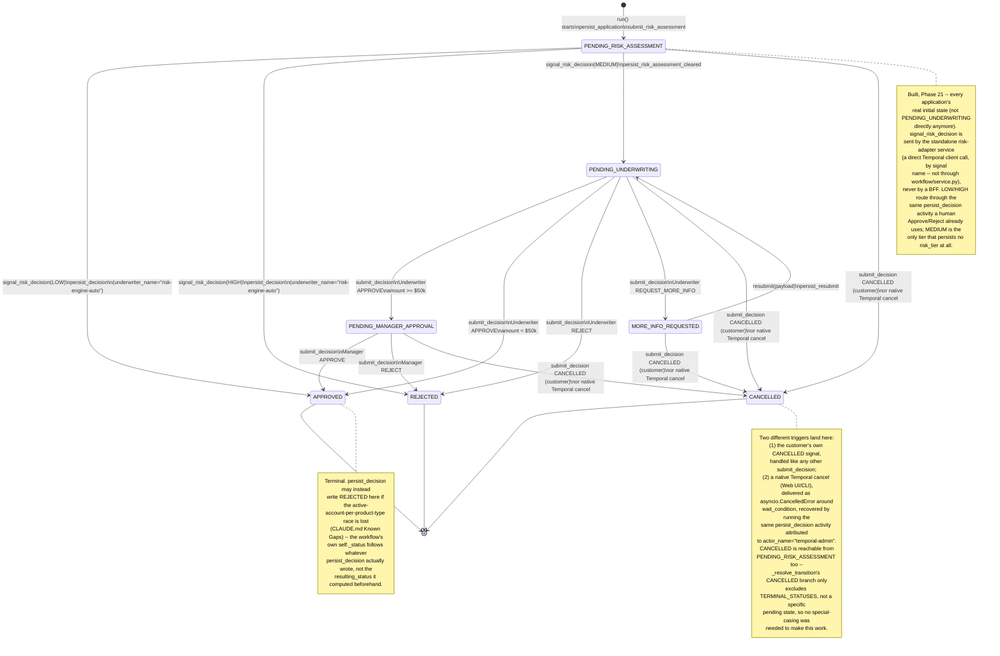

# Loan application workflow — Temporal state machine

Source of truth: `loan_onboarding/workflow/workflows.py`'s
`LoanApplicationWorkflow`. This is the *runtime* view — one Temporal
workflow execution per loan application, its states, the signals that
drive transitions between them, and which activity (called by string
name, per `CLAUDE.md`'s "Breaking the application ↔ workflow cycle")
persists each one. For the *code-module* view, see
[`application-modules.md`](application-modules.md); for the
*container/process* view, see
[`system-architecture.md`](system-architecture.md).

## Activities

The concrete implementations behind every activity call above live in
`loan_onboarding/application/activities.py`, registered under these
exact string names — `workflows.py` calls them by name, never by
import, per `CLAUDE.md`'s "Breaking the application ↔ workflow cycle."

| Activity Name | What It Does |
|---|---|
| `persist_application` | Writes the initial `applications` row when the workflow starts — application id, applicant identifier, customer id (nullable), workflow id, product type, payload, denormalized applicant name/email/phone, amount, and (built, Phase 21) the explicit `initial_status` (`PENDING_RISK_ASSESSMENT`) `run()` passes in, no longer an implicit database `DEFAULT`. |
| `submit_risk_assessment` (built, Phase 21) | Calls `risk.service.submit_risk_assessment(...)` — a plain `httpx` POST to the standalone `risk-adapter` service's `/assessments` endpoint. Fire-and-forget from the workflow's own perspective: the eventual decision arrives later, as the `signal_risk_decision` signal, not as this activity's return value. |
| `persist_decision` | Records an Approve/Reject/RequestMoreInfo/Cancel decision **or** a risk-driven auto-Approve/auto-Reject (Phase 21 — `actor_name="risk-engine-auto"`, `risk_tier` written). On a terminal Approve, provisions the customer and account, promotes the Government ID to the customer's photo, and generates the Welcome Letter — idempotently, skipping all of that on a retry that already provisioned. If it loses the active-account-per-product-type race, converts the outcome to a clean Reject instead of failing the workflow. Returns whatever status it actually wrote. |
| `persist_risk_assessment_cleared` (built, Phase 21) | The `MEDIUM`-tier outcome only: a plain status flip out of `PENDING_RISK_ASSESSMENT` into `PENDING_UNDERWRITING`, no actor/decision/comment, no `risk_tier` write — a dedicated, minimal activity rather than overloading `persist_decision` with a fourth, non-decision "decision" value. |
| `persist_resubmit` | Records the customer's resubmitted payload after a RequestMoreInfo, and moves the application back to pending underwriting. |

## Reading this diagram

- **One activity call per transition, always by string name** — every
  arrow above is backed by exactly one `workflow.execute_activity(...)`
  call inside `workflows.py` (`persist_application` + `submit_risk_assessment`
  once each at `run()` start, `persist_decision` for every
  `submit_decision`- or terminal-`signal_risk_decision`-driven
  transition including native-cancel recovery,
  `persist_risk_assessment_cleared` for the `MEDIUM` outcome,
  `persist_resubmit` for the `resubmit` signal). `workflow/` never
  imports the concrete `@activity.defn` functions in
  `application/activities.py` — see `CLAUDE.md`'s "Breaking the
  application ↔ workflow cycle" for why.
- **`signal_risk_decision` is sent by a process outside this whole
  package** — the standalone `risk-adapter` service, via its own
  independent `temporalio.client.Client`, calling the signal *by name*
  (`handle.signal("signal_risk_decision", risk_tier)`), the same way
  every activity above is called by name rather than by import. No
  `workflow/service.py` wrapper function exists for this signal (unlike
  `signal_decision`/`signal_resubmit`/the `CloseAccountWorkflow` signals,
  which every BFF route goes through) — see `docs/api-specification.md`
  for why this one signal is a documented exception to that pattern.
- **The guard on `signal_risk_decision` checks more than
  `_claim_transition()`'s busy/finalized flag** — it also requires
  `self._status == PENDING_RISK_ASSESSMENT`, since resolving to `MEDIUM`
  is non-terminal (it clears `_busy` without setting `_finalized`). A
  duplicate/late delivery of this signal after a `MEDIUM` resolution —
  a real possibility, since NATS is at-least-once and so is the
  Adapter's own retry of a failed signal call — would otherwise
  successfully re-claim the transition and mis-transition again;
  `_claim_transition()` alone isn't enough to prevent it.
- **`PENDING_UNDERWRITING` → `PENDING_MANAGER_APPROVAL` vs. straight to
  `APPROVED`** is the one loan-specific business rule this otherwise-
  generic workflow module hardcodes directly:
  `MANAGER_ESCALATION_THRESHOLD_USD = 50_000` (PRD §6.3), checked
  against `amount` — the one field of the payload this workflow
  actually looks at.
- **`MORE_INFO_REQUESTED` is the only non-terminal state with an
  outgoing edge back into the flow** (`resubmit`, not `submit_decision`)
  — a customer, not staff, drives that transition, and it always lands
  back on `PENDING_UNDERWRITING` regardless of which role most recently
  requested more info.
- **`_claim_transition()`'s `_busy` flag** (not drawn — it's a
  same-execution concurrency guard, not a workflow state) makes every
  arrow above atomic against a second signal arriving mid-transition:
  set synchronously before the first `await`, cleared only once that
  transition's activity call returns. A signal that arrives while
  another is in flight is silently ignored, not queued.
- **`APPROVED`'s asterisk** (see note): this diagram shows the
  workflow's *intended* transition, computed by `_resolve_transition()`
  before the activity runs. What `self._status` actually ends up as
  comes back as `persist_decision`'s *return value* — normally the same
  status, but a losing side of the active-account-per-product-type race
  (`CLAUDE.md`'s "Applying without being a customer yet" /  Known Gaps)
  gets silently converted to `REJECTED` inside that activity instead of
  raising, so the workflow's own state stays consistent with whatever
  Postgres actually holds.
- **Account/customer provisioning on `APPROVED` is not drawn here** —
  it happens inside `persist_decision` (the activity, in
  `application/activities.py`), not inside the workflow's own state
  machine. This diagram is scoped to what `workflows.py` itself decides
  and signals; see `CLAUDE.md`'s "Applying without being a customer
  yet" for that sequence.
