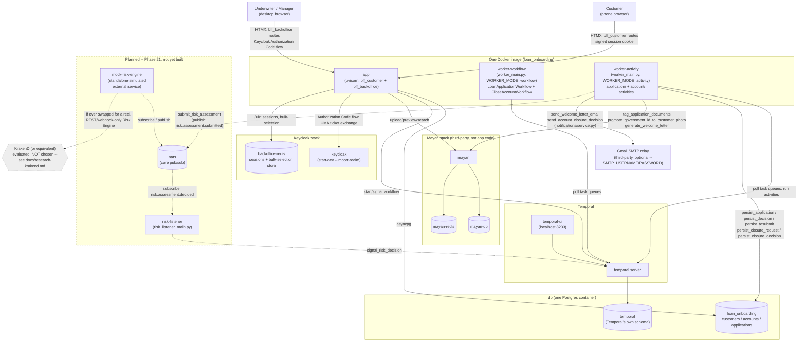

# System architecture diagram — local dev / Docker Compose topology

Source of truth: `CLAUDE.md`'s "Deployment" and "Docker Compose
topology (local dev)" sections. This is the *process/container* view —
one Docker image, multiple running processes, several third-party
containers. For the *code-module* view (which Python package imports
which), see [`application-modules.md`](application-modules.md).

**Three build statuses appear in this diagram, styled distinctly**:
solid boxes/arrows are **built and live-verified**; the dashed
`riskPlanned` subgraph (Phase 21) is **planned, not yet built** —
`nats`/`mock-risk-engine`/`risk-listener` don't exist as running
containers today; the dotted `krakend` node is **evaluated, not
chosen** — a candidate for a later, unscoped enhancement (a real,
non-mock Risk Engine speaking REST/webhooks instead of NATS), not part
of any committed topology. See `docs/research-krakend.md` for why it's
drawn this way rather than wired into the Phase 21 subgraph.

## Reading this diagram

- **One image, several processes** — `app`, `worker-workflow`, and
  `worker-activity` all run from the same built image, just started
  with a different entrypoint/`WORKER_MODE` (`CLAUDE.md`'s
  "Deployment"). Not three separately-built artifacts.
- **`worker-activity` is the only process that writes to `loan_onboarding`
  directly** — the web (`app`) process never writes `applications`/
  `accounts` rows itself; it starts/signals a workflow and polls its
  own read path (`_wait_until()`) waiting for the activity worker to
  commit. See `CLAUDE.md`'s "Breaking the application ↔ workflow
  cycle."
- **`worker-workflow`/`worker-activity` now run two workflow types, not
  one** (built, Phase 18) — `CloseAccountWorkflow` alongside
  `LoanApplicationWorkflow`, on its own dedicated (non-product-type-keyed)
  task queue, registered via the same `WORKER_MODE`-governed
  `worker_main.py` process pair. No new container — this is a topology
  change inside the existing two processes, not a new one.
- **`worker-activity` also talks to Mayan and, optionally, Gmail** —
  not just Postgres. The account-on-approval provisioning (`CLAUDE.md`'s
  "Applying without being a customer yet") runs inside
  `persist_decision`, which is activity code, hence this process (not
  `app`) is what calls
  `tag_application_documents`/`promote_government_id_to_customer_photo`/
  `generate_welcome_letter`, and (built, Phase 20) what calls
  `notifications.service`'s two real-email functions. The Gmail edge is
  **opt-in** — it only fires when `SMTP_USERNAME`/`SMTP_PASSWORD` are
  set on `worker-activity`; unset, `notifications/service.py` falls
  through to its original fake `print()` path and no network call to
  Gmail happens at all. `send_verification_code` (the OTP flow) is
  deliberately never wired to Gmail — no edge for it in this diagram.
- **The Phase 21 subgraph is dashed because none of it is running
  today** — `nats`, `mock-risk-engine`, and `risk-listener` are planned
  Docker Compose services (`CLAUDE.md`'s "Automated risk assessment via
  NATS"), not yet added to `docker-compose.yml`. `risk-listener` signals
  Temporal directly (`workflow.service.signal_risk_decision(...)`), the
  same way `bff_backoffice`'s decision routes signal a human decision —
  it does not go through `app`.
- **KrakenD is drawn separately from the Phase 21 subgraph on purpose**
  — it's research material (`docs/research-krakend.md`), not a
  committed part of the Phase 21 design. If Phase 21 is ever extended
  to swap the mock engine for a real, REST/webhook-only one, KrakenD (or
  an equivalent) is one candidate for the NATS↔HTTP translation layer
  that would sit in `mock-risk-engine`'s position — nothing about this
  has been decided, and the research note itself flags that only the
  decision-callback leg (webhook in → NATS publish) fits KrakenD's own
  request/response model cleanly; the submission leg needs either a
  polling-capable real engine or a small dedicated bridge process.
- **Keycloak's `backoffice-redis` and Mayan's `mayan-redis` are
  separate Redis instances** — named distinctly, no shared state
  between the two, matching `CLAUDE.md`'s explicit "not
  `mayan-redis`" callout.
- **Keycloak has no dedicated Postgres** — `start-dev` mode uses an
  in-memory H2 database; not pictured because there's nothing durable
  to show.
- **`docker-compose.yml`'s optional split** (`app-customer` +
  `app-backoffice` as two separate processes/services instead of one
  `app`) isn't drawn here — it's a scaling-profile choice with no
  effect on any arrow in this diagram, since the module boundaries and
  in-process calls underneath are identical either way (`CLAUDE.md`'s
  "Deployment").
