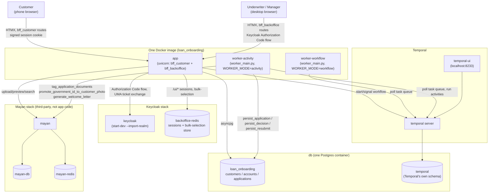

# System architecture diagram — local dev / Docker Compose topology

Source of truth: `CLAUDE.md`'s "Deployment" and "Docker Compose
topology (local dev)" sections. This is the *process/container* view —
one Docker image, multiple running processes, several third-party
containers. For the *code-module* view (which Python package imports
which), see [`application-modules.md`](application-modules.md).

## Reading this diagram

- **One image, several processes** — `app`, `worker-workflow`, and
  `worker-activity` all run from the same built image, just started
  with a different entrypoint/`WORKER_MODE` (`CLAUDE.md`'s
  "Deployment"). Not three separately-built artifacts.
- **`worker-activity` is the only process that writes to `loan_onboarding`
  directly** — the web (`app`) process never writes `applications`
  rows itself; it starts/signals the workflow and polls its own read
  path (`_wait_until()`) waiting for the activity worker to commit. See
  `CLAUDE.md`'s "Breaking the application ↔ workflow cycle."
- **`worker-activity` also talks to Mayan** — not just Postgres. The
  account-on-approval provisioning (`CLAUDE.md`'s "Applying without
  being a customer yet") runs inside `persist_decision`, which is
  activity code, hence this process (not `app`) is what calls
  `tag_application_documents`/`promote_government_id_to_customer_photo`/
  `generate_welcome_letter`.
- **Keycloak's `backoffice-redis` and Mayan's `mayan-redis` are
  separate Redis instances** — named distinctly, no shared state
  between the two, matching `CLAUDE.md`'s explicit "not
  `mayan-redis`" callout.
- **Keycloak has no dedicated Postgres** — `start-dev` mode uses an
  in-memory H2 database; not pictured because there's nothing durable
  to show.
- **`docker-compose.yml`'s optional split** (`app-customer` +
  `app-backoffice` as two separate processes/services instead of one
  `app`) isn't drawn here — it's a scaling-profile choice with no
  effect on any arrow in this diagram, since the module boundaries and
  in-process calls underneath are identical either way (`CLAUDE.md`'s
  "Deployment").
