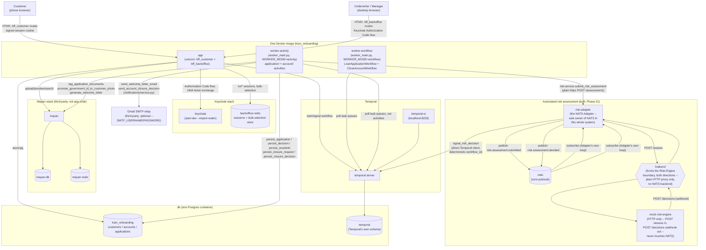

# System architecture diagram — local dev / Docker Compose topology

Source of truth: `CLAUDE.md`'s "Deployment" and "Docker Compose
topology (local dev)" sections. This is the *process/container* view —
one Docker image, multiple running processes, several third-party
containers. For the *code-module* view (which Python package imports
which), see [`application-modules.md`](application-modules.md).

**Everything in this diagram is built and live-verified**, including
the `risk` subgraph (Phase 21) — `nats`/`mock-risk-engine`/
`risk-adapter`/`krakend` are real running containers, exercised end to
end through the actual customer UI (three real applications, one per
amount bucket, each resolving correctly). See `CLAUDE.md`'s "Automated
risk assessment via NATS" / the `risk-assessment-nats` skill for the
full reasoning, and `docs/research-krakend.md` for the general KrakenD
research that led here.

## Reading this diagram

- **One image, several processes** — `app`, `worker-workflow`, and
  `worker-activity` all run from the same built image, just started
  with a different entrypoint/`WORKER_MODE` (`CLAUDE.md`'s
  "Deployment"). Not three separately-built artifacts.
- **`worker-activity` is the only process that writes to `loan_onboarding`
  directly** — the web (`app`) process never writes `applications`/
  `accounts` rows itself; it starts/signals a workflow and polls its
  own read path (`_wait_until()`) waiting for the activity worker to
  commit. See `CLAUDE.md`'s "Breaking the application ↔ workflow
  cycle."
- **`worker-workflow`/`worker-activity` now run two workflow types, not
  one** (built, Phase 18) — `CloseAccountWorkflow` alongside
  `LoanApplicationWorkflow`, on its own dedicated (non-product-type-keyed)
  task queue, registered via the same `WORKER_MODE`-governed
  `worker_main.py` process pair. No new container — this is a topology
  change inside the existing two processes, not a new one.
- **`worker-activity` also talks to Mayan and, optionally, Gmail** —
  not just Postgres. The account-on-approval provisioning (`CLAUDE.md`'s
  "Applying without being a customer yet") runs inside
  `persist_decision`, which is activity code, hence this process (not
  `app`) is what calls
  `tag_application_documents`/`promote_government_id_to_customer_photo`/
  `generate_welcome_letter`, and (built, Phase 20) what calls
  `notifications.service`'s two real-email functions. The Gmail edge is
  **opt-in** — it only fires when `SMTP_USERNAME`/`SMTP_PASSWORD` are
  set on `worker-activity`; unset, `notifications/service.py` falls
  through to its original fake `print()` path and no network call to
  Gmail happens at all. `send_verification_code` (the OTP flow) is
  deliberately never wired to Gmail — no edge for it in this diagram.
- **`worker-activity` never touches NATS, and neither does the Risk
  Engine** — the only edge `worker-activity` gains for Phase 21 is a
  plain internal HTTP call to `risk-adapter`. Every NATS-protocol detail
  (connect, publish, subscribe) lives entirely inside `risk-adapter`,
  the one new component that owns it end to end.
- **KrakenD sits specifically at the Risk-Engine boundary, both
  directions** — `risk-adapter`'s own outbound call to
  `mock-risk-engine`'s `POST /assess`, and `mock-risk-engine`'s own
  inbound call to `risk-adapter`'s `POST /decisions` webhook, both go
  *through* KrakenD. It's a plain HTTP↔HTTP reverse-proxy here, not
  KrakenD's own NATS pub/sub backend feature — using that feature would
  have given KrakenD its own NATS dependency, contradicting "the Adapter
  is the only thing that depends on NATS." This is simpler than
  `docs/research-krakend.md`'s own earlier speculative sketch explored
  (which worried about KrakenD bridging a NATS subject to an outbound
  HTTP call on its own — moot now, since `risk-adapter` does that
  bridging itself).
- **`risk-adapter` signals Temporal directly, not through `app`** — it
  computes the deterministic `loan-application-<application_id>`
  workflow id itself (same scheme `workflow/service.py`'s own
  `_workflow_id_for_application` already uses) and sends the signal via
  its own `temporalio.client.Client` connection, the same kind of
  standard, client-authorized action `bff_backoffice`'s decision routes
  already perform, just issued from a different process.
- **Keycloak's `backoffice-redis` and Mayan's `mayan-redis` are
  separate Redis instances** — named distinctly, no shared state
  between the two, matching `CLAUDE.md`'s explicit "not
  `mayan-redis`" callout.
- **Keycloak has no dedicated Postgres** — `start-dev` mode uses an
  in-memory H2 database; not pictured because there's nothing durable
  to show.
- **`docker-compose.yml`'s optional split** (`app-customer` +
  `app-backoffice` as two separate processes/services instead of one
  `app`) isn't drawn here — it's a scaling-profile choice with no
  effect on any arrow in this diagram, since the module boundaries and
  in-process calls underneath are identical either way (`CLAUDE.md`'s
  "Deployment").
